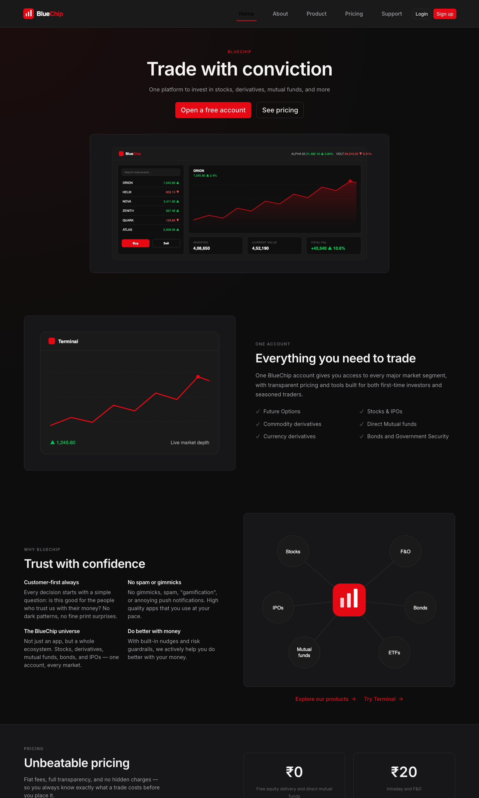

# BlueChip — Crypto Paper-Trading Platform

A full-stack **crypto paper-trading platform** built with the **MERN stack** (MongoDB, Express, React, Node.js). Anyone can sign up, get **$100,000 in simulated funds**, and trade Bitcoin, Ethereum, Solana and more at **real live prices from the Gemini exchange** — market data streams in over Gemini's public WebSocket, and orders execute against a custom-built simulated exchange engine with market & limit orders, an order matcher, portfolio history, and a leaderboard.

> Paper trading only: no real money is ever deposited, withdrawn, or at risk. "BlueChip" is a fictional brand, not affiliated with Gemini or any real broker.

📖 **New here? Read [docs/PROJECT_GUIDE.md](docs/PROJECT_GUIDE.md)** — a complete walkthrough of every technology choice (and why), the architecture, and what every file in the repo does.



---

## ✨ Features

- **Live Gemini market data** — one shared backend feed (WebSocket streaming + REST fallback, no API key needed) serves every user: live watchlist, tickers, and real OHLC candlestick charts
- **Simulated exchange engine** — market orders fill instantly at the live price; limit orders rest in the book and a background matcher fills them when the market crosses (price-or-better), with atomic no-overdraft accounting (conditional MongoDB updates, no locks)
- **Per-user portfolios** — every account starts with $100k simulated cash; holdings track weighted-average cost; sell-all leaves no float dust
- **Portfolio history** — periodic + per-fill snapshots power a real performance chart (no fake data)
- **Leaderboard** — all traders ranked by live portfolio value
- **Authentication** — signup & login with bcrypt-hashed passwords and JWT
- **Public-ready hardening** — rate limiting (auth, orders, global), body-size caps, `/healthz`, always-visible paper-trading disclaimer

---

## 🏗️ Architecture

This is a monorepo with three independent applications:

```
BlueChip/
├── frontend/     # Landing site (React + CRA)           → http://localhost:3000
├── dashboard/    # Trading dashboard (React + MUI)      → http://localhost:3001
└── backend/      # REST API + exchange engine (Express) → http://localhost:3002
```

| App | Tech | Port |
|-----|------|------|
| **frontend** | React 19 + TypeScript, React Router, Bootstrap, Axios | 3000 |
| **dashboard** | React 19 + TypeScript, Material UI, Chart.js (+ financial charts), Axios | 3001 |
| **backend** | Express 5, Mongoose, JWT, bcrypt, ws (Gemini WebSocket) | 3002 |

**How prices flow:** the backend keeps one in-memory price cache. Gemini's public v2 market-data WebSocket streams trades into it (with heartbeat watchdog + exponential-backoff reconnect); a REST poller runs underneath as permanent fallback and supplies the 24h-change figure. The dashboard polls the cached prices — no user ever hits Gemini directly, so rate limits never scale with user count.

**How trades settle:** entirely in our own MongoDB. Balance and holdings mutations are conditional atomic updates (`updateOne({balance: {$gte: cost}}, {$inc: ...})`) so concurrent orders can never overdraw an account — a losing race becomes a clean `REJECTED` order.

---

## 🚀 Getting Started

### Prerequisites
- [Node.js](https://nodejs.org/) v18+ (global `fetch` is used for Gemini REST calls)
- A [MongoDB](https://www.mongodb.com/atlas) database (Atlas or local)

### 1. Clone the repo
```bash
git clone https://github.com/sogoyalz/BlueChip.git
cd BlueChip
```

### 2. Set up the backend
```bash
cd backend
npm install
cp .env.example .env      # then fill in your real values (see below)
npm start                 # starts on http://localhost:3002
```

### 3. Set up the frontend (landing site)
```bash
cd frontend
npm install
npm start                 # starts on http://localhost:3000
```

### 4. Set up the dashboard
```bash
cd dashboard
npm install
npm start                 # starts on http://localhost:3001
```

> Run each in its own terminal tab. Start the backend first so the dashboard gets prices and data.

---

## 🔑 Environment Variables

Each app uses a `.env` file (never committed — see `.env.example` for the template).

**`backend/.env`**
```env
MONGO_URL=your_mongodb_connection_string
TOKEN_KEY=your_jwt_secret
PORT=3002
# Production only: comma-separated allowed browser origins
# CORS_ORIGINS=https://your-landing.netlify.app,https://your-dashboard.netlify.app
```

**`frontend/.env`**
```env
PORT=3000
# Optional — override backend origins for deployed environments:
# REACT_APP_API_URL=https://your-backend.example.com
# REACT_APP_DASHBOARD_URL=https://your-dashboard.example.com
```

**`dashboard/.env`**
```env
PORT=3001
# Optional — override backend/login origins for deployed environments:
# REACT_APP_API_URL=https://your-backend.example.com
# REACT_APP_LOGIN_URL=https://your-landing.example.com/login
```

---

## 📡 API Endpoints

Base URL: `http://localhost:3002`

| Method | Endpoint | Auth | Description |
|--------|----------|------|-------------|
| `POST` | `/signup` | — | Register (seeds $100k simulated cash) |
| `POST` | `/login` | — | Log in and receive a JWT |
| `POST` | `/` | — | Verify the current auth token |
| `GET` | `/healthz` | — | Health: WebSocket + price freshness |
| `GET` | `/api/symbols` | — | Supported Gemini pairs |
| `GET` | `/api/prices` | — | Live price cache (all symbols) |
| `GET` | `/api/candles/:symbol?timeframe=1hr` | — | OHLCV history (cached proxy) |
| `GET` | `/allHoldings` | ✅ | Your holdings, enriched with live prices |
| `GET` | `/api/account` | ✅ | Balance + live portfolio value |
| `POST` | `/api/orders` | ✅ | Place a MARKET or LIMIT order |
| `GET` | `/api/orders` | ✅ | Your orders (`?status=open` for resting) |
| `POST` | `/api/orders/:id/cancel` | ✅ | Cancel a resting limit order |
| `GET` | `/api/leaderboard` | ✅ | All traders ranked by portfolio value |
| `GET` | `/api/portfolio/history?range=1W` | ✅ | Portfolio value snapshots |
| `POST` | `/api/account/reset` | ✅ | Wipe holdings/orders, restore $100k |

✅ = requires a valid JWT (cookie, `Authorization: Bearer`, or `?token=`).

**Place an order:**
```json
POST /api/orders
{ "symbol": "BTCUSD", "side": "BUY", "type": "LIMIT", "qty": 0.05, "limitPrice": 64000 }
```

---

## 🧪 Testing

```bash
cd backend && npx jest      # engine, matcher, feeds, routes (100+ tests, no DB needed)
cd dashboard && npm test    # dashboard component tests
cd frontend && npm test     # landing-site component tests
```

Backend tests mock Mongoose models and the price feed, so they run fast and offline — including the concurrency edge cases (double-submit near full balance, cancel-vs-fill races, insufficient funds at limit-fill time).

---

## ☁️ Deploying (when you're ready)

The repo is deploy-ready but nothing is deployed by default.

1. **MongoDB Atlas** — create a free M0 cluster, get the connection string.
2. **Backend → Render** (free tier): root directory `backend`, build `npm install && npm run build`, start `npm run serve`. Env: `MONGO_URL`, `TOKEN_KEY`, `CORS_ORIGINS` (both Netlify URLs).
3. **Frontends → Netlify** (two sites): `frontend/netlify.toml` and `dashboard/netlify.toml` are already in place. Set the `REACT_APP_*` env vars per site (they're baked at build time).
4. **Keep-alive**: point a free uptime pinger (UptimeRobot / cron-job.org) at `GET /healthz` every ~10 min — on Render's free tier the server sleeps when idle, which pauses the limit-order matcher and snapshots.

---

## 📂 Project Structure

```
backend/
├── config/         # curated Gemini symbol list
├── controllers/    # request handlers (auth)
├── middlewares/    # JWT verification, rate limits
├── model/          # Mongoose models
├── schemas/        # Mongoose schemas (User, Holding, Order, Snapshot)
├── routes/         # auth, market data, orders, portfolio
├── services/       # the interesting bits:
│   ├── gemini.ts       # Gemini REST wrappers
│   ├── geminiWs.ts     # WebSocket feed (watchdog + backoff reconnect)
│   ├── priceFeed.ts    # shared in-memory price cache
│   ├── orderEngine.ts  # validation + atomic fills
│   ├── matcher.ts      # background limit-order matcher
│   └── snapshots.ts    # portfolio history
├── util/           # token helpers, money rounding
└── index.ts        # app entry point

frontend/src/landing_page/
├── home/  about/  products/  pricing/  support/
├── login/  signup/
└── Navbar.tsx  Footer.tsx  ...

dashboard/src/components/
├── Dashboard.tsx  Holdings.tsx  Orders.tsx  Leaderboard.tsx
├── Funds.tsx  WatchList.tsx  Summary.tsx  MarketDetail.tsx
├── PricesContext.tsx  (shared live-price poll)
└── shared/  (BuySellModal, CandleChart, DataTable, ...)
```

---

## 📝 License

This project is for educational purposes. Not for commercial use.
